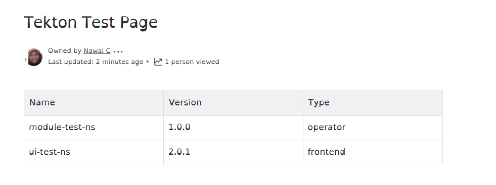

# update-confluence-pipeline
## Pipeline Setup and Execution

### 1. Start a Local Kubernetes Cluster
Use Minikube to start a local Kubernetes cluster:
```sh
minikube start
```
To verify it worked, run:
```sh
kubectl cluster-info
```
You should see information about the Minikube cluster.

### 2. Set Minikube Context
Set the current Kubernetes context to Minikube:
```sh
kubectl config use-context minikube
```
To confirm, check the current context:
```sh
kubectl config current-context
```
It should return `minikube`.

### 3. Install Tekton Pipelines
Install the latest Tekton Pipelines on the Kubernetes cluster:
```sh
kubectl apply -f https://storage.googleapis.com/tekton-releases/pipeline/latest/release.yaml
```
To verify, check the Tekton Pipelines pods:
```sh
kubectl get pods -n tekton-pipelines
```
You should see pods with names starting with `tekton`.

### 4. Apply Task Configuration
Apply the `task.yaml` configuration in the default namespace:
```sh
kubectl apply -f task.yaml -n default
```
To confirm, list the tasks:
```sh
kubectl get tasks -n default
```
You should see your task listed.

### 5. Apply Pipeline Run Configuration
Apply the `pipeline-run.yaml` configuration in the default namespace:
```sh
kubectl apply -f pipeline-run.yaml -n default
```
To verify, list the pipeline runs:
```sh
kubectl get pipelineruns -n default
```
You should see your pipeline run listed.

### 6. Monitor Task Run Status
Retrieve the status of the task runs in the default namespace:
```sh
kubectl get taskruns -n default
```
Ensure the status column shows `Succeeded` or `Running`.

### 7. View Task Run Logs
Retrieve the logs of the task run named `update-confluence-run-update-page`:
```sh
kubectl logs -n default update-confluence-run-update-page --all-containers
```
Check the logs for any errors or successful execution messages.

### 8. Describe the Task Run
Get detailed information about the task run:
```sh
kubectl describe taskrun update-confluence-run-update-page -n default
```
Look for the `Conditions` section to confirm the task run status.

### 9. Check Pod Status
Retrieve the status of the pods in the default namespace:
```sh
kubectl get pods -n default
```
Ensure the pods related to your pipeline are in the `Running` or `Completed` state.

### 10. View Logs of a Specific Pod Step
Retrieve the logs of the specific step `step-run-python` in the pod:
```sh
kubectl logs -n default update-confluence-run-update-page-pod -c step-run-python
```
Check the logs for any errors or successful execution messages.

### 11. Create a Secret for Confluence Credentials
Create a secret named `confluence-creds` with the Confluence URL, username, and personal access token:
```sh
kubectl create secret generic confluence-creds \
    --from-literal=url=https://nwalcareem.atlassian.net/wiki \
    --from-literal=user=nwal.careem@gmail.com \
    --from-literal=pat=<your-api-token> \
    -n default
```
To verify, list the secrets:
```sh
kubectl get secrets -n default
```
You should see `confluence-creds` in the list.


### 12. Access the Confluence Page
Once the pipeline completes successfully, navigate to the Confluence page to verify the updates. Use the following URL:
```
https://nwalcareem.atlassian.net/wiki/spaces/MFS/pages/229377/Tekton+Test+Page
```

### 13. Screenshot of Successful Pipeline Run
Below is an example screenshot of a successful pipeline run in the Tekton Dashboard:


